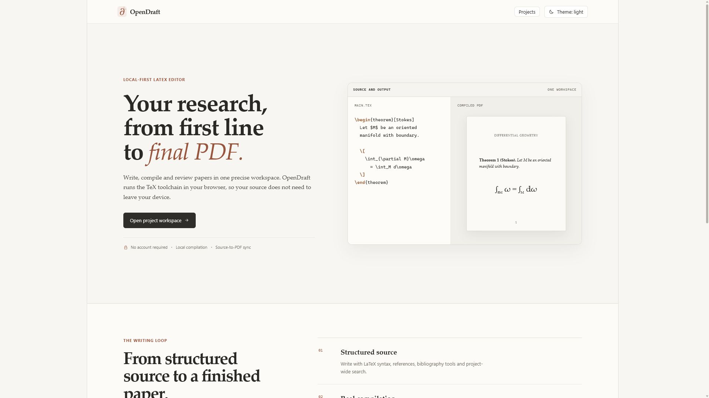
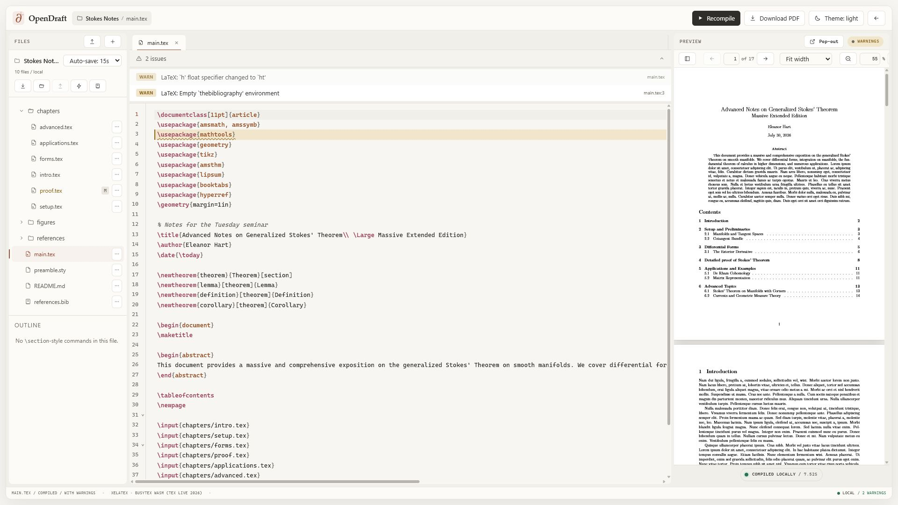
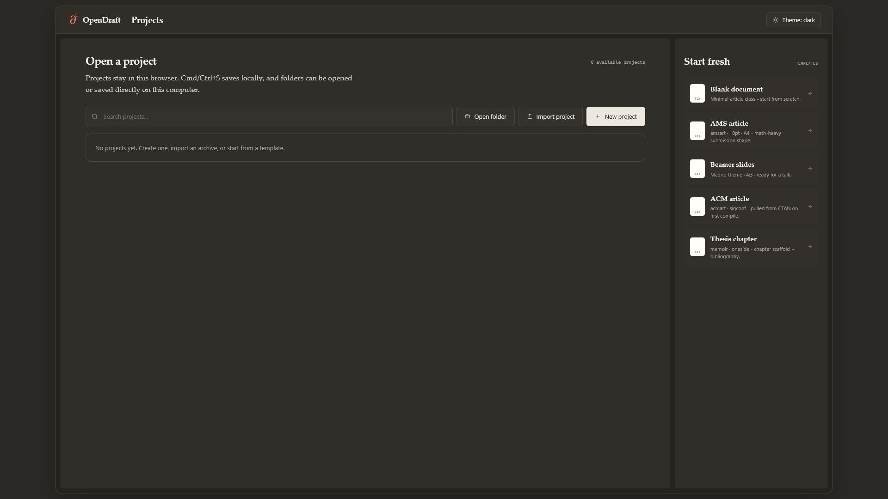
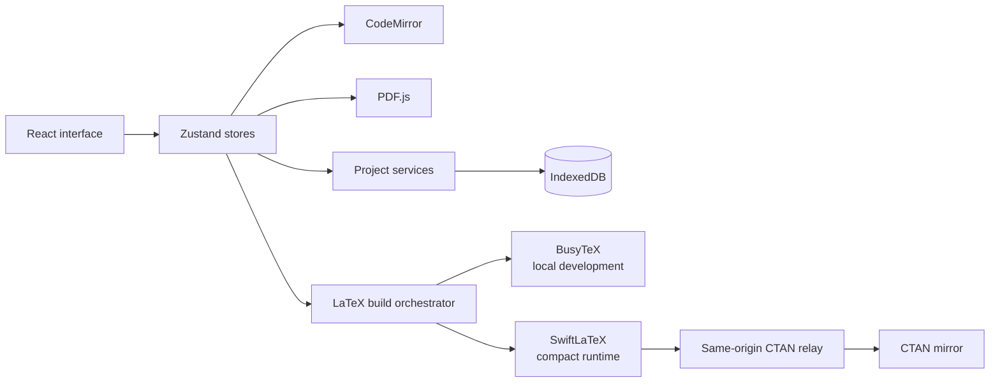

<h1 align="center">
  
  OpenDraft
</h1>

<p align="center">
  <strong>A local-first LaTeX workspace for technical writing.</strong>
</p>

<p align="center">
  Write, compile and review scientific documents without sending their source to a document
  server.
</p>

<p align="center">
  <a href="https://github.com/jorgeflmendes/opendraft/actions/workflows/ci.yml"></a>
  <a href="./LICENSE"></a>
  
  
  
</p>

<p align="center">
  <a href="#product-tour">Product tour</a> ·
  <a href="#capabilities">Capabilities</a> ·
  <a href="#architecture">Architecture</a> ·
  <a href="#local-development">Local development</a> ·
  <a href="#documentation">Documentation</a>
</p>

<p align="center">
  
</p>

## Overview

OpenDraft brings the essential LaTeX workflow into one precise browser interface: project
management, structured source editing, local compilation and PDF review. Projects are persisted
in IndexedDB and can be imported, exported or connected to a folder selected by the user.

The application has no account gate and no remote document store. TeX runs in a Web Worker;
when the compact runtime needs a package, only that public package is fetched from CTAN through
a same-origin relay.

## Product tour

<p align="center">
  
  <br>
  <sub>Source, compiler diagnostics and a multi-page PDF in the same workspace.</sub>
</p>

<p align="center">
  
  <br>
  <sub>Local projects, folder access, portable imports and focused starting templates.</sub>
</p>

## Capabilities

- **Browser-native compilation** — compile with a real WebAssembly TeX engine without uploading
  project source.
- **Purpose-built source editor** — CodeMirror 6 with LaTeX highlighting, completion, folding,
  search, multi-cursor editing and TeX-aware spellchecking.
- **Integrated PDF review** — selectable PDF text, page and zoom input, fit controls, keyboard and
  pointer shortcuts, plus source-to-PDF navigation when SyncTeX data is available.
- **Local project storage** — atomic, file-sharded IndexedDB persistence keeps content saves
  focused on the files that changed.
- **Portable projects** — import and export project archives, or read and write a user-selected
  local folder through the File System Access API.
- **Technical writing tools** — bibliography management, document outline, project-wide search,
  compiler diagnostics and configurable keyboard shortcuts.

## Architecture



OpenDraft keeps UI state, persistence and compilation behind separate interfaces. BusyTeX is the
preferred local engine when its full TeX Live assets are installed; the smaller SwiftLaTeX runtime
is used as a production-capable fallback with on-demand package resolution.

Read [Architecture](./docs/ARCHITECTURE.md) for module boundaries, persistence invariants and
security assumptions.

## Local development

### Requirements

- Node.js 20.19 or newer
- npm
- `xz` available on `PATH` for engine provisioning

### Start the full development environment

```bash
git clone https://github.com/jorgeflmendes/opendraft.git
cd opendraft
npm ci
npm run setup:engine
npm run dev
```

Vite prints the local URL after startup. The complete setup installs BusyTeX for the primary local
runtime and SwiftLaTeX for fallback and production validation.

To provision only the compact runtime:

```bash
npm run setup:engine:swift
```

### Production build

```bash
npm run build
npm run preview
```

The production artifact uses the compact SwiftLaTeX runtime and relays CTAN package requests
through the deployment worker. See [Deployment](./docs/DEPLOY.md) before publishing.

## Quality

```bash
npm run quality
npm run test:e2e
```

The quality pipeline covers type checking, linting, formatting, repository hygiene, dependency
auditing, unit and integration coverage, and a production build. Playwright exercises the real
browser workers and verifies that compiled PDF glyphs are painted to the canvas.

## Repository layout

```text
.
├── docs/           Architecture, quality, deployment and LaTeX support
├── public/         Static browser assets and provisioned engine files
├── scripts/        Reproducible engine and build utilities
├── src/
│   ├── components/ Shared interface components
│   ├── domain/     Application contracts and invariants
│   ├── features/   Editor, preview, projects and supporting workflows
│   ├── services/   Persistence, compilation and project I/O
│   └── store/      Cross-feature application state
└── tests/          Browser-level integration and accessibility tests
```

## Documentation

| Guide                                    | Purpose                                                 |
| ---------------------------------------- | ------------------------------------------------------- |
| [Architecture](./docs/ARCHITECTURE.md)   | System boundaries, persistence model and runtime design |
| [LaTeX support](./docs/LATEX_SUPPORT.md) | Engine capabilities and package compatibility           |
| [Quality](./docs/QUALITY.md)             | Test strategy, coverage and validation commands         |
| [Deployment](./docs/DEPLOY.md)           | Production artifact and hosting requirements            |
| [Security policy](./SECURITY.md)         | Supported versions and vulnerability reporting          |

## Current limitations

- Packages that require unrestricted shell escape, such as `minted` invoking a host Python
  process, cannot run inside the WebAssembly sandbox.
- Very large projects remain subject to the browser tab's memory and storage limits.
- File System Access API support varies by browser; archive import and export remain available
  when direct folder access is unsupported.
- SyncTeX navigation requires an engine result containing SyncTeX output.

## License

OpenDraft is available under the [MIT License](./LICENSE).
